# UAS Teknologi Cloud
# Kubernetes
#### Andri Siswanto/175410166
---------------------

1. Membuat File dengan nama Dockerfile
 
   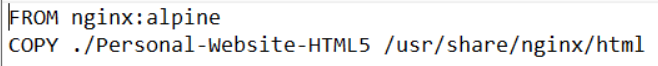
  

2. Membuat Image dari Dockerfile 

   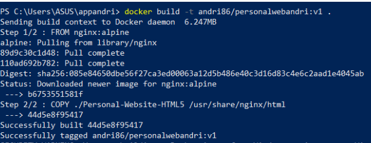

3. Mengupload ke hub.docker.com

    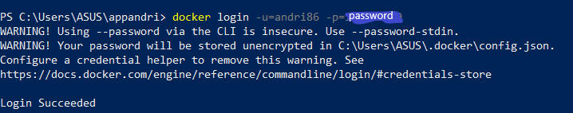
    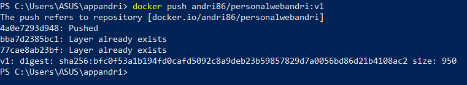
    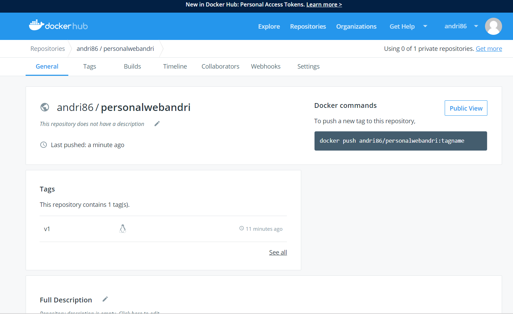

4. Membuat deployment untuk image melalui terminal kubernetes.io/

    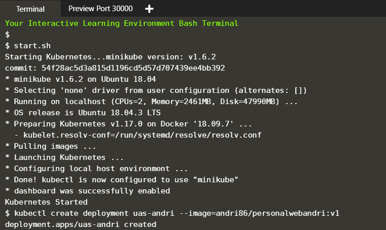

5. Cek status

    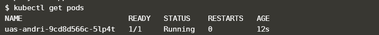

6. Membuat service untuk meng-expose port 80

    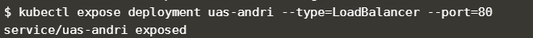

7. Melihat Service yang berjalan

    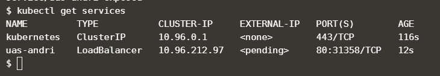

8. Klik tanda plus pada terminal di kubernetes.io/, kemudian pilih select port to    view on Host 1

    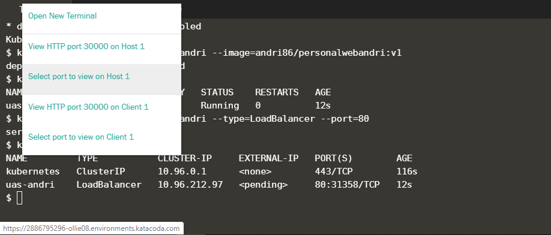

9. Memasukkan port sesuai dengan port yang didapat sewaktu mengecek dengan "get      services"

    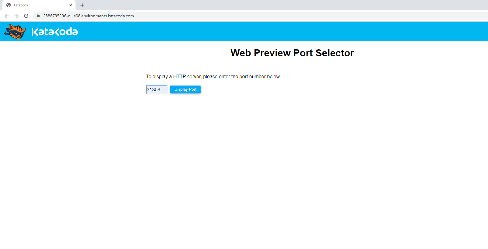

10. Hasil tampilan pada browser

    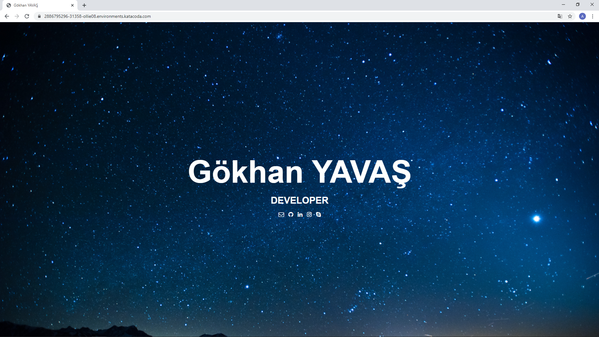
